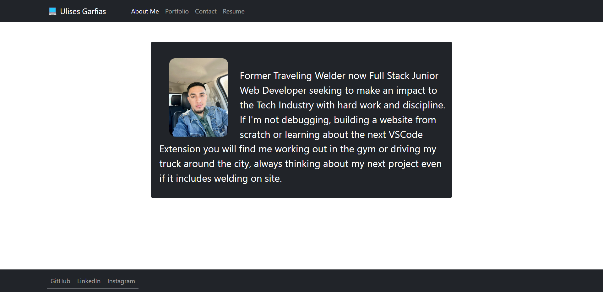
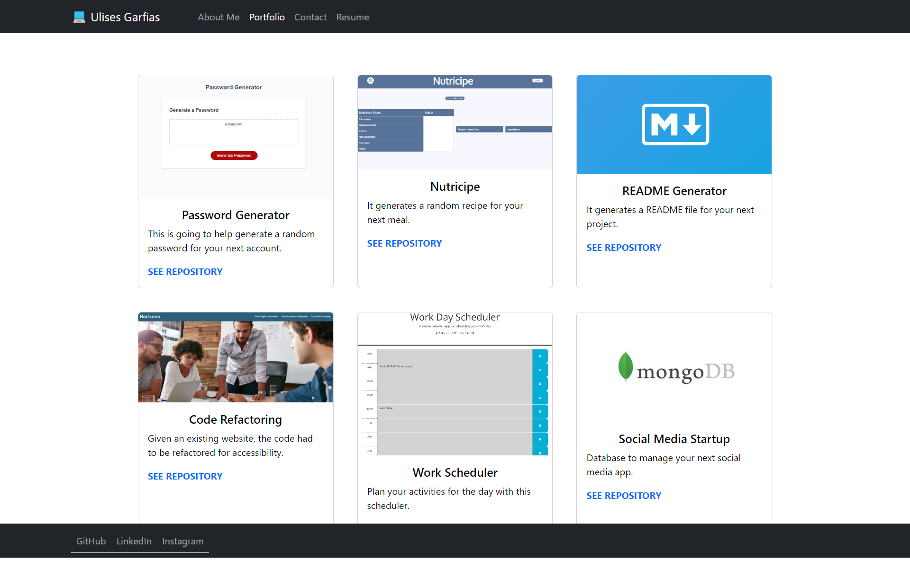
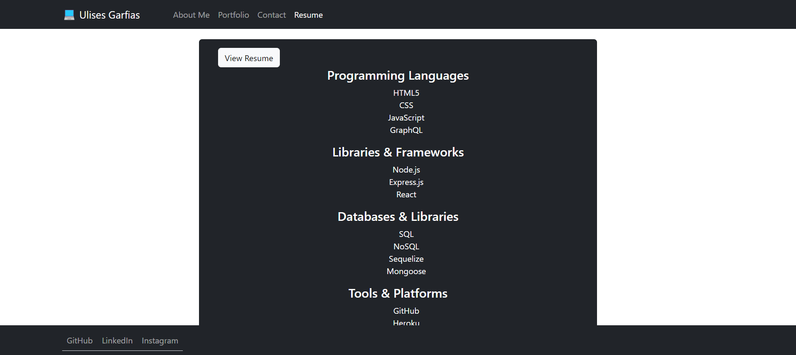

# PORTFOLIO BUILT IN REACT JS

## Description

A portfolio is a great and unique way to showcase quality projects and let potential employers know about yourself and the work quality you can bring to the table.

React is a free and open-source front-end JavaScript library for building user interfaces based on components. It can be used to build web, mobile and desktop applications.

## Table of Contents (Optional)
- [Installation](#installation)
- [Usage](#usage)
- [Credits](#credits)
- [License](#license)

## Installation
- to create a new react project we have to run the next command in the terminal: npx create-react-app ->name of the app<-
- command to install React-bootstrap: npm install react-bootstrap bootstrap

## Usage
Once the website loads the user will be presented with the main page which will be called "About Me" and the Navigation bar on the top will take the user to different pages in the portfolio.

The "Portfolio" page will show 6 projects that have access to the deployed version of the project and the repository where to code is being stored, when the image is clicked the user will be taken to the deployed version if there is one, when the line of text "SEE REPOSITORY" is clicked, the user will be taken to the GitHub repository of that project.

The "Resume" page will show all the skills acquired by the developer throughout his career and by clicking "View Resume" the user will be taken to a different website where a professional resume will be displayed.

## Credits
- https://react.dev/
- https://react-bootstrap.github.io/
- Tutor: Jose Lopez

## License
MIT License

Copyright (c) [2023] [Ulises_Garfias]

Permission is hereby granted, free of charge, to any person obtaining a copy
of this software and associated documentation files (the "Software"), to deal
in the Software without restriction, including without limitation the rights
to use, copy, modify, merge, publish, distribute, sublicense, and/or sell
copies of the Software, and to permit persons to whom the Software is
furnished to do so, subject to the following conditions:

The above copyright notice and this permission notice shall be included in all
copies or substantial portions of the Software.

THE SOFTWARE IS PROVIDED "AS IS", WITHOUT WARRANTY OF ANY KIND, EXPRESS OR
IMPLIED, INCLUDING BUT NOT LIMITED TO THE WARRANTIES OF MERCHANTABILITY,
FITNESS FOR A PARTICULAR PURPOSE AND NONINFRINGEMENT. IN NO EVENT SHALL THE
AUTHORS OR COPYRIGHT HOLDERS BE LIABLE FOR ANY CLAIM, DAMAGES OR OTHER
LIABILITY, WHETHER IN AN ACTION OF CONTRACT, TORT OR OTHERWISE, ARISING FROM,
OUT OF OR IN CONNECTION WITH THE SOFTWARE OR THE USE OR OTHER DEALINGS IN THE
SOFTWARE.